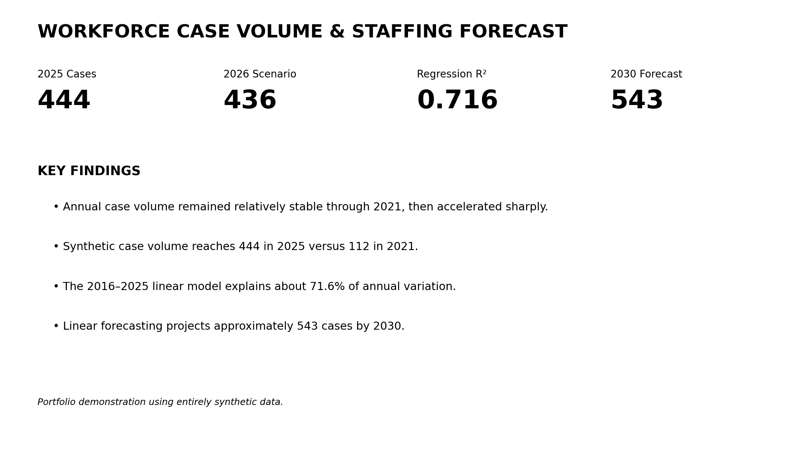
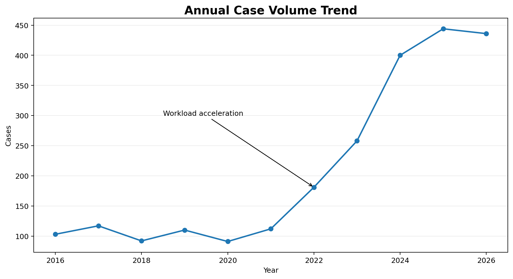
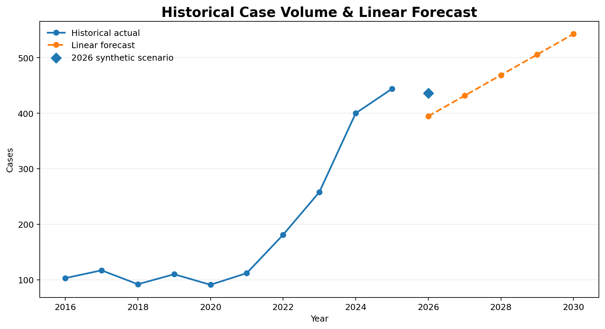
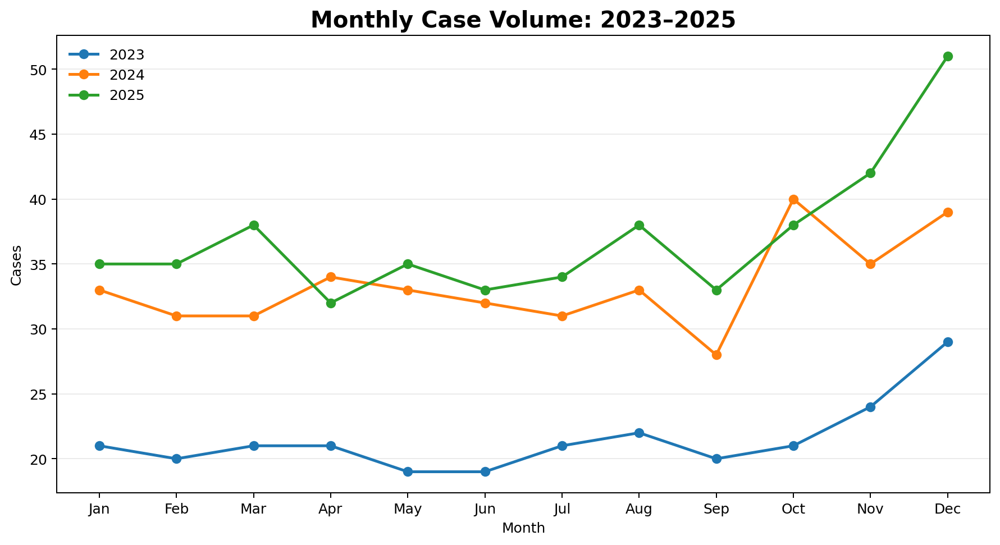
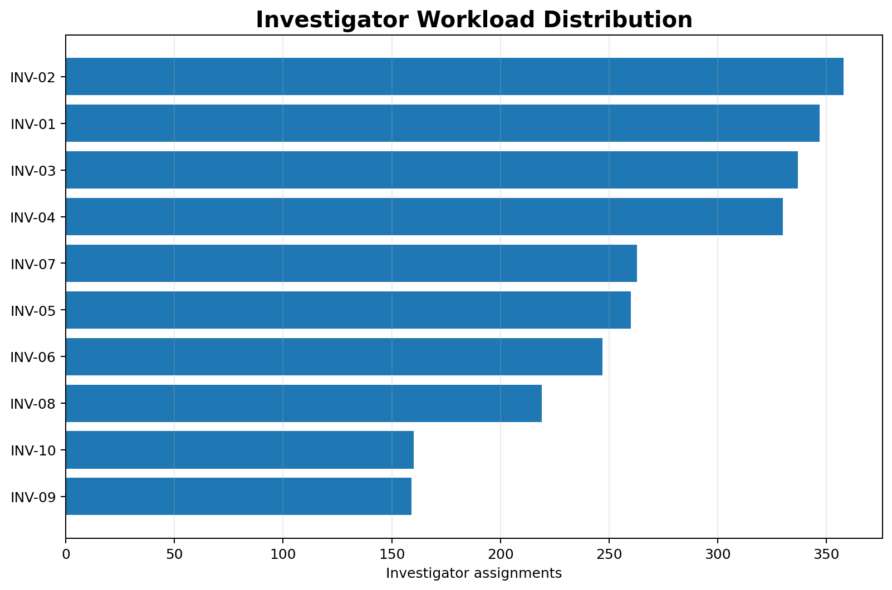

# Workforce Case Volume & Staffing Forecast Analysis

An end-to-end workforce analytics project analyzing historical case volume, workload distribution, monthly patterns, and future demand using **Excel, Power Query, PivotTables, linear regression, and forecasting**.

> **Note:** This portfolio project uses an entirely synthetic dataset. No confidential case records, employee information, personally identifiable information, or organizational data are included.

---

## Project Overview

This project demonstrates how historical workload data can be transformed into actionable workforce-planning insights.

The analysis evaluates synthetic case data from **2016–2026** to answer four primary business questions:

1. How has case volume changed over time?
2. Are there identifiable monthly workload patterns?
3. How is workload distributed among investigators?
4. What could future case volume look like if historical trends continue?

The project combines data preparation, exploratory analysis, workload analysis, statistical modeling, forecasting, and business interpretation.

---

## Executive Dashboard



### Key Findings

* Annual case volume increased substantially after 2021.
* Synthetic case volume increased from **112 cases in 2021 to 444 cases in 2025**, an increase of approximately **296%**.
* A linear regression model using completed 2016–2025 annual data produced an **R² of approximately 0.716**.
* The model projects approximately **432 cases in 2027**, increasing to approximately **543 cases by 2030**.
* Investigator assignment analysis demonstrates how workload distribution can be evaluated across a team.
* Monthly analysis provides additional insight into workload patterns that annual totals alone may not reveal.

---

## Business Problem

Workforce planning becomes difficult when workload changes substantially over time.

Historical staffing levels that were sufficient when annual case volume was approximately 100 cases may no longer be appropriate when annual workload exceeds 400 cases.

This project demonstrates how historical case data can be used to:

* Quantify workload growth
* Identify changes in workload patterns
* Evaluate workload distribution
* Forecast future demand
* Support evidence-based staffing discussions

---

## Tools & Techniques

### Excel

* PivotTables
* PivotCharts
* `FORECAST.LINEAR`
* `RSQ`
* `SLOPE`
* `INTERCEPT`
* Year-over-year calculations
* Percentage calculations
* Dashboard development

### Power Query

Power Query was used to transform investigator assignment data.

Cases containing multiple investigators were split into individual assignment records so that workload could be analyzed at the investigator level.

Example:

`INV-01, INV-04`

becomes:

`INV-01`

`INV-04`

This allows shared cases to be represented appropriately in investigator workload calculations.

### Statistical Analysis

A simple linear regression model was used to evaluate the relationship between calendar year and annual case volume.

The model was trained using completed annual observations from **2016–2025**.

---

## Annual Case Volume



Annual case volume remained relatively stable through 2021 before increasing substantially beginning in 2022.

| Year | Cases |
| ---: | ----: |
| 2016 |   103 |
| 2017 |   117 |
| 2018 |    92 |
| 2019 |   110 |
| 2020 |    91 |
| 2021 |   112 |
| 2022 |   181 |
| 2023 |   258 |
| 2024 |   400 |
| 2025 |   444 |

The increase from **112 cases in 2021 to 444 cases in 2025** represents approximately **296% growth**.

This suggests a meaningful shift in workload rather than a single isolated high-volume year.

---

## Case Volume Forecast



Linear regression was performed using annual case totals from **2016–2025**.

### Model Results

| Metric                   |         Result |
| ------------------------ | -------------: |
| R²                       |          0.716 |
| Approximate annual slope | +37 cases/year |
| 2027 forecast            |            432 |
| 2028 forecast            |            469 |
| 2029 forecast            |            506 |
| 2030 forecast            |            543 |

An R² of approximately **0.716** indicates that about **71.6% of the historical variation in annual case volume is explained by the linear time trend**.

The forecast should be interpreted as a planning scenario rather than an exact prediction. The historical increase was not perfectly linear, and future workload may be affected by factors not represented in the model.

---

## Monthly Workload Analysis



Monthly case volume was analyzed to determine whether annual workload alone might conceal shorter-term workload patterns.

Examining monthly activity can help identify:

* High-volume periods
* Low-volume periods
* Potential seasonal patterns
* Changes in workload throughout the year

Monthly analysis can also complement annual forecasting when evaluating staffing capacity.

---

## Investigator Workload Distribution



Investigator assignments were standardized and transformed before workload calculations were performed.

When multiple investigators were assigned to the same case, the assignment field was split so that each investigator received an individual assignment record.

Workload percentage was calculated as:

**Investigator Assignments ÷ Total Investigator Assignments**

This allows the analysis to identify whether workload is evenly distributed or concentrated among particular investigators.

---

## Forecasting Methodology

The regression model uses:

**Independent variable:** Year

**Dependent variable:** Annual case volume

The model was trained only on completed annual observations from **2016 through 2025**.

The synthetic 2026 scenario was intentionally excluded from model training so that an estimated year would not be treated as an observed completed year.

Forecasts were generated using Excel's `FORECAST.LINEAR` function.

---

## Business Interpretation

The analysis demonstrates how a relatively simple historical dataset can provide useful workforce-planning information.

The most important finding is not simply that case volume increased. The data indicate that the workload environment after 2021 is substantially different from the earlier period.

If elevated workload continues, workforce planning should consider:

* Projected annual case volume
* Cases per active investigator
* Investigator availability
* Workload distribution
* Case complexity
* Historical growth
* Sustainable caseload expectations

A future extension of this analysis could estimate staffing requirements using:

**Projected Case Volume ÷ Sustainable Cases per Investigator = Estimated Investigators Required**

---

## Limitations

This project has several important limitations.

* The dataset is synthetic and was created for portfolio demonstration purposes.
* Linear regression assumes that the historical relationship between year and case volume continues.
* Case volume alone does not measure case complexity.
* Investigator assignment counts do not account for differences in case duration or difficulty.
* Staffing capacity may also be affected by leave, administrative responsibilities, tenure, and other duties.
* Forecasts represent analytical estimates rather than guaranteed future outcomes.

---

## Repository Structure

```text
workforce-case-volume-analysis/
│
├── analysis/
│   ├── README.md
│   └── workforce_case_volume_analysis.xlsx
│
├── data/
│   ├── README.md
│   └── workforce_case_volume_synthetic_dataset.xlsx
│
├── images/
│   ├── README.md
│   ├── annual_case_trend.png
│   ├── case_volume_forecast.png
│   ├── monthly_case_trends.png
│   ├── investigator_workload.png
│   └── excel_dashboard.png
│
├── LICENSE
└── README.md
```

---

## Data Privacy

All case-level data contained in this repository are **synthetic**.

The repository does not contain original case numbers, investigator names or initials, employee information, personally identifiable information, confidential case information, or internal organizational records.

Synthetic identifiers such as `INV-01` and `SYN-2025-XXXX` are used solely for analytical demonstration.

---

## Future Enhancements

Future versions of this project may include:

* Power BI interactive dashboard
* Monthly time-series forecasting
* Confidence intervals for forecasts
* Investigator capacity modeling
* Staffing requirement scenarios
* Additional forecasting model comparisons

---

## License

Original code and analysis materials in this repository are provided under the MIT License.

The dataset included in this project is synthetic and is provided solely for portfolio and educational demonstration purposes.

